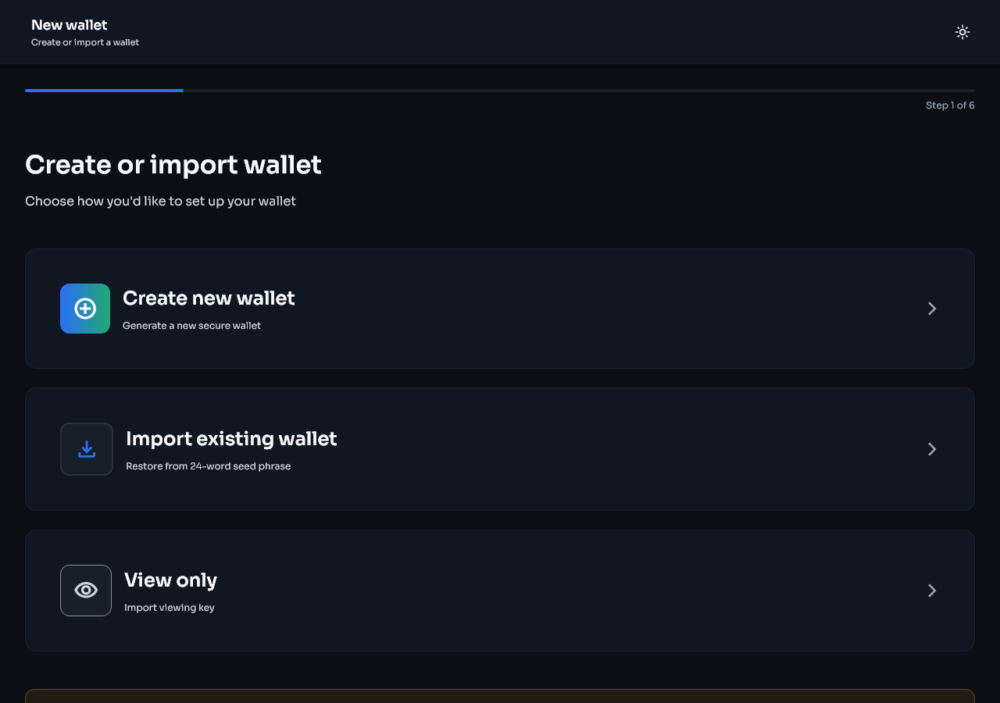
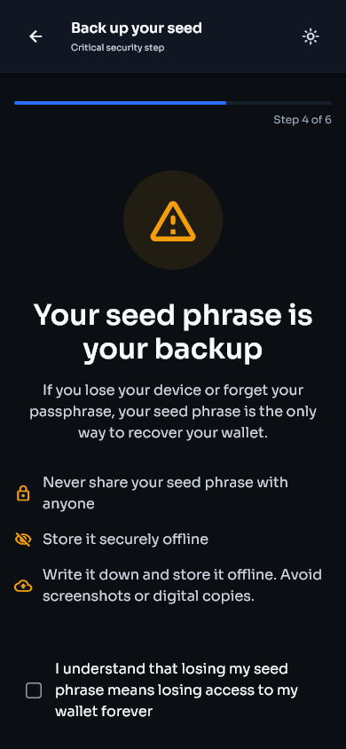
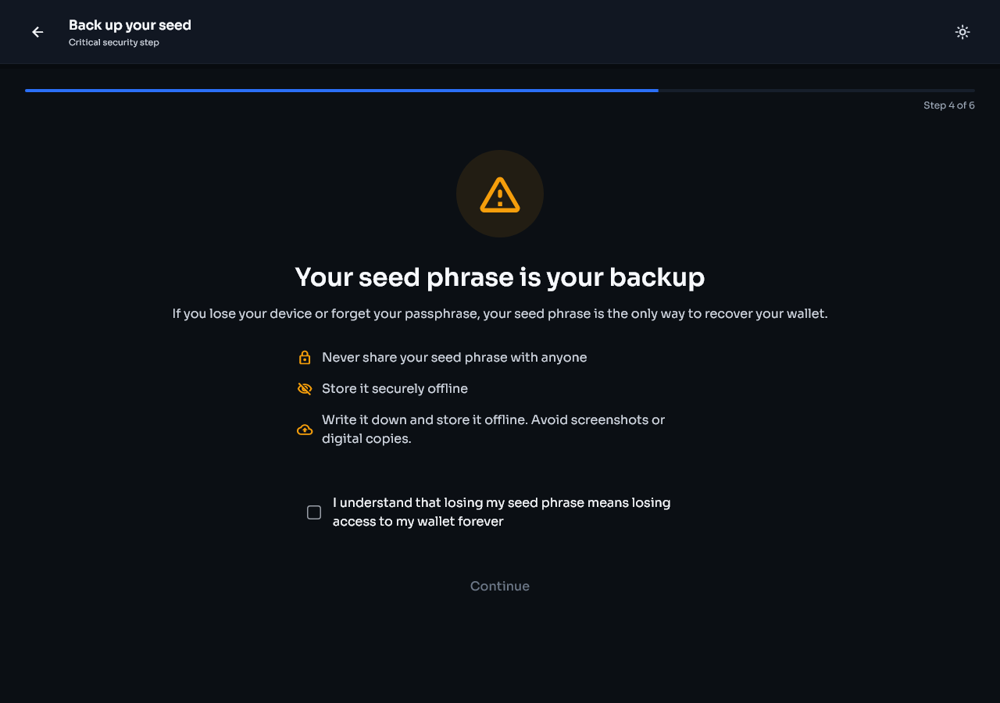
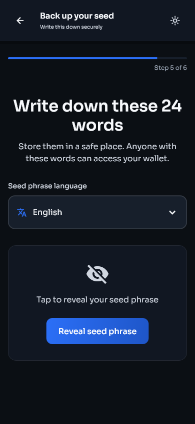
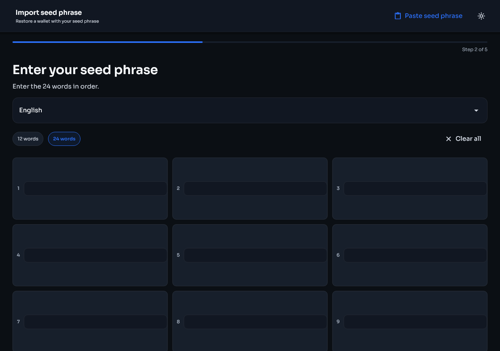
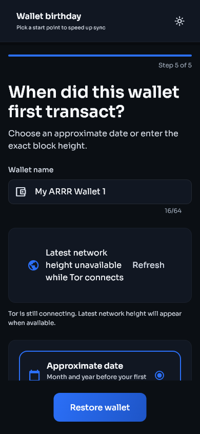
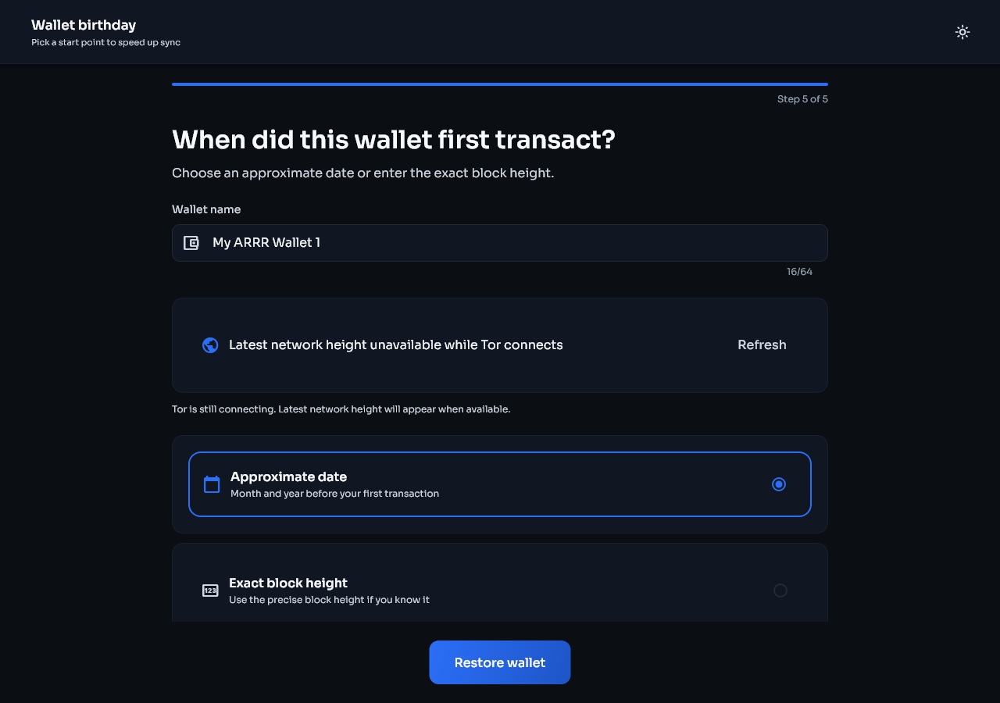
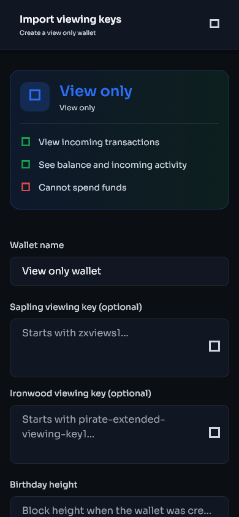
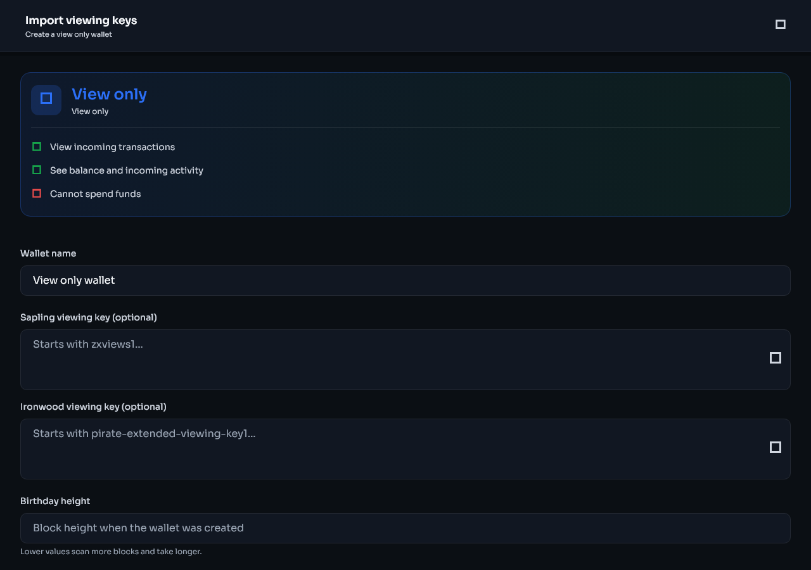

# Install and set up Stashi Wallet

[Guide contents](README.md) | [Next: Wallet basics](wallet-basics.md)

## Download the file

Download Stashi Wallet from the [official Pirate Unified Wallet releases on GitHub](https://github.com/PirateNetwork/Pirate-Unified-Light-Wallet/releases) or the [Pirate Chain Wallets page](https://piratechain.com/wallets/). Do not install wallet files received through direct messages or file-sharing websites.

Select the package for your device:

- For Windows, download `Stashi-Wallet-windows-installer.exe`.
- For macOS, download `Stashi-Wallet-macos.dmg`. The package supports Apple Silicon and Intel Macs.
- For Linux, select the format supported by your distribution:
  - Download `Stashi-Wallet-linux-x86_64.AppImage` for a portable file that runs on most 64-bit Linux distributions without installation.
  - Download `Stashi-Wallet-amd64.deb` for a Debian-based distribution such as Debian, Ubuntu, Linux Mint, Pop!_OS, or Zorin OS.
  - Download `Stashi-Wallet.flatpak` if your distribution supports Flatpak or you normally install applications through Flatpak. Fedora, Endless OS, and many other distributions can use this format after Flatpak is enabled.
- For Android, use `Stashi-Wallet-android-V8.apk` on a current 64-bit ARM mobile device or tablet. Use `Stashi-Wallet-android-V7.apk` only on an older 32-bit ARM device that cannot install the V8 package.
- Stashi Wallet is not yet distributed for iPhone or iPad. Until an iOS version is available, use a third-party wallet with Pirate Chain support, such as Edge.

The release includes SHA-256 checksums and PGP signatures. See [Verify the downloaded release files](settings-and-verification.md#verify-the-downloaded-release-files) to check the files before installation.

## Open Stashi Wallet

1. Install or open Stashi Wallet.
2. Confirm that the name and icon match the official release.
3. Select **Get started** on the welcome screen.
4. Select **Create new wallet**, **Import existing wallet**, or **View only**.

| Mobile | Desktop |
|---|---|
|  |  |

| Setup choices on mobile | Setup choices on desktop |
|---|---|
|  |  |

## Create a new wallet

A local passphrase works like a password for Stashi Wallet on this device. It must contain at least 12 characters, including letters, numbers, and symbols. A passphrase of at least 16 characters is recommended. It cannot read the same forwards and backwards. Use a unique passphrase that you do not use for another account.

The 24-word seed phrase controls the funds in a seed-derived wallet. Anyone who obtains the words can spend the funds. The local passphrase protects the wallet on this device, but it cannot replace or recover a lost seed phrase.

1. Select **Create new wallet**.
2. Create the local passphrase.
3. Enable device biometrics if you want faster unlocking. Biometrics do not replace the seed phrase.
4. Read the backup warning.
5. Write the 24 words of the seed phrase on paper or another offline medium, in the exact order shown.
6. Review the suggested wallet name. New wallets start with **My ARRR Wallet 1** and continue with the next number. You can edit the name before creation.
7. Confirm the requested words.
8. Store the seed phrase somewhere protected from theft, fire, and water.
9. Wait for synchronisation to finish before relying on the displayed balance.

| Mobile | Desktop |
|---|---|
|  |  |

The phrase language control appears above the seed words. Leave it set to the language used for the backup.

| Mobile | Desktop |
|---|---|
|  |  |

The final confirmation page allows you to name the wallet before it is created.

| Mobile | Desktop |
|---|---|
|  |  |

Do not photograph the seed phrase, store it in a cloud note, send it by email, or enter it into a website.

## Import an existing wallet with a seed phrase

1. Select **Import existing wallet**.
2. Select the language of the seed phrase if it is not already selected.
3. Enter all 24 words in order. Check the spelling and language if the seed phrase is rejected.
4. Create the local passphrase and decide whether to enable biometrics.
5. Review or change the suggested wallet name.
6. Enter the wallet birthday height. Use a block height from before the wallet first received funds. An earlier height is safe but requires more time to scan.
7. Finish the setup and allow the scan to complete.
8. Check the balance and Activity page.
9. If the previous wallet used additional ZIP-32 seed accounts, follow [Find funds in higher seed accounts](migration.md#find-funds-in-higher-seed-accounts).

The birthday height is the earliest blockchain height that Stashi Wallet will inspect for this wallet. It is not the wallet creation date. Enter a height before the first expected transaction so that earlier activity is not excluded.

| Mobile | Desktop |
|---|---|
|  |  |

| Wallet name and birthday height on mobile | Wallet name and birthday height on desktop |
|---|---|
|  |  |

Importing the seed phrase does not restore private keys that were imported separately. Import those keys again under **Settings > Keys & addresses**.

## Create a view-only wallet

A view-only wallet can monitor supported shielded activity but cannot spend the funds.

1. Select **View only**.
2. Enter a wallet name.
3. Enter a Sapling viewing key, an Ironwood viewing key, or both in the matching fields.
4. Enter a birthday height from before the first transaction for the viewing key.
5. Finish the setup and allow the scan to complete.

| Mobile | Desktop |
|---|---|
|  |  |

A Sapling viewing key begins with `zxviews1`. An Ironwood viewing key begins with `pirate-extended-viewing-key1`. Paste each key into the matching field. Keep viewing keys private because they can reveal transaction information within their scope.

## After setup

Confirm the following points before receiving a payment:

- The wallet opens with the passphrase or biometric method that you expect.
- You have checked the seed phrase backup twice.
- The network status shows a connection, and synchronisation has reached the current chain height.
- You can open **Receive**, generate an address, and copy it.
- The wallet selected at the top of the screen is the wallet that you intend to use.
