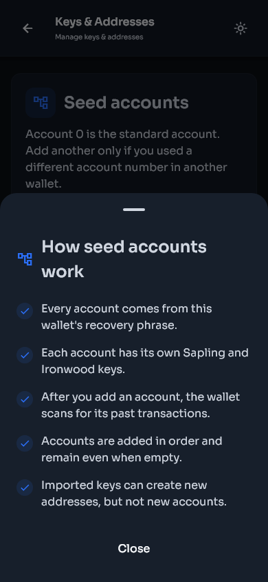
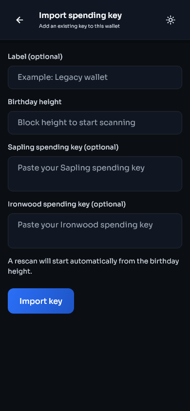
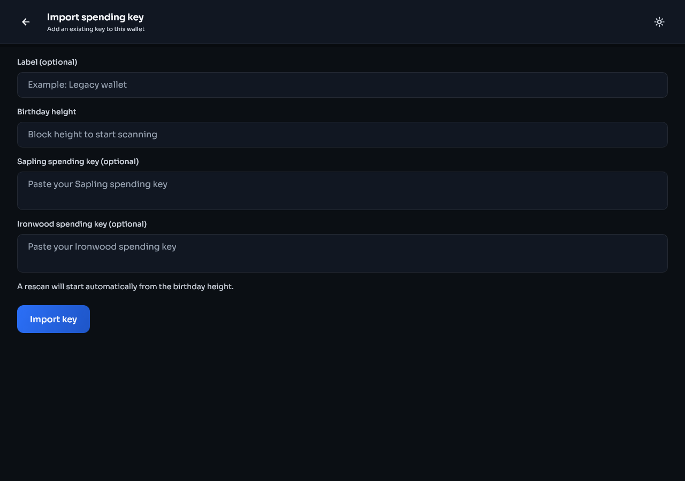
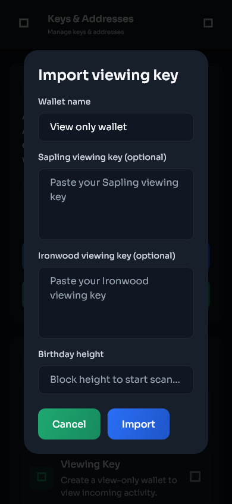
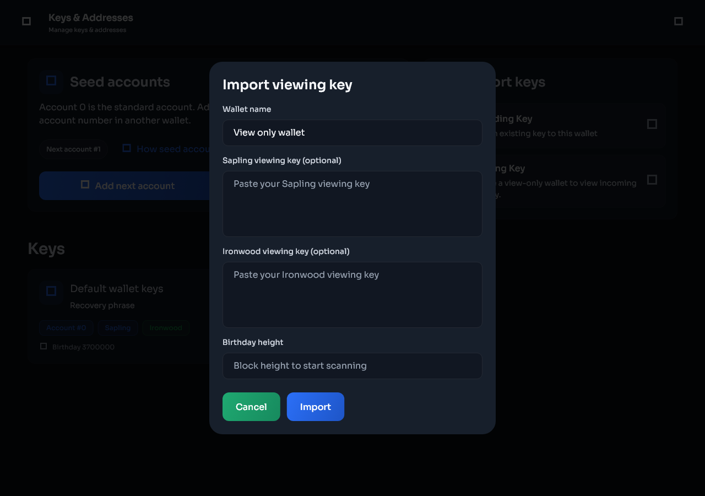

# Seed accounts, keys, and addresses

[Previous: Send and receive](send-receive.md) | [Guide contents](README.md) | [Next: Moving from another wallet](migration.md)

Open **Settings > Keys & addresses** to view the key groups available to the selected wallet.

| Mobile | Desktop |
|---|---|
|  |  |

## Seed accounts

A seed phrase can derive many numbered ZIP-32 accounts. Account 0 is the standard account used by most wallets. Accounts 1, 2, and higher are separate account key groups derived from the same seed phrase.

Each seed account added by Stashi Wallet includes its supported Sapling and Ironwood key material. The account number is not a diversified address number.

Use these controls only when you know or suspect that another wallet used a higher account number:

- **Add next account** adds the next consecutive seed account and starts the required scan.
- **Add 5 accounts** adds the next five consecutive seed accounts and starts the required scan.

The controls do not skip account numbers. Wait for the current account scan to finish before adding another group.

Select **How seed accounts work** to read the same explanation in Stashi Wallet.

| Mobile | Desktop |
|---|---|
|  |  |

### When to add seed accounts

Add seed accounts in the following circumstances:

- You imported a seed phrase from another wallet and some transaction history is missing.
- The previous wallet allowed you to create more than one account from the same seed phrase.
- You know that a payment was sent to a higher-numbered account.

Do not add large numbers of accounts without a reason. Each added key group gives the scanner more keys to test and can increase scanning work.

## Imported spending keys

An imported spending key controls a single key scope. It can spend the notes that it owns and can generate supported diversified addresses for that key. It cannot derive sibling seed accounts because it does not contain the parent seed phrase.

To import a spending key:

1. Open **Settings > Keys & addresses**.
2. Select **Spending Key** under Import keys.
3. Enter the spending key.
4. Enter a birthday height from before its first transaction.
5. Confirm the import.
6. Allow the automatic rescan to finish.
7. Open the imported key and check its balance and addresses.

| Mobile | Desktop |
|---|---|
|  |  |

The seed account controls do not apply to imported spending keys.

## Imported viewing keys

A viewing key can detect supported incoming activity and derive addresses within its key scope, but it cannot spend funds or derive sibling seed accounts.

To import a viewing key into an existing wallet:

1. Open **Settings > Keys & addresses**.
2. Select **Viewing Key**.
3. Enter a wallet name.
4. Enter the viewing key in the matching Sapling or Ironwood field.
5. Enter a suitable birthday height.
6. Confirm the import and allow the rescan to finish.

| Mobile | Desktop |
|---|---|
|  |  |

Use a separate view-only wallet when you want to monitor activity without storing spending authority on that device.

## Sapling and Ironwood

Sapling and Ironwood are different Pirate Chain shielded pools. Their addresses and keys are not interchangeable.

| Key type | How to recognise a viewing key | Use |
|---|---|---|
| Sapling | The viewing key begins with `zxviews1` | Monitors activity and derives addresses within a Sapling key scope |
| Ironwood | The viewing key begins with `pirate-extended-viewing-key1` | Monitors activity and derives addresses within an Ironwood key scope |

The labels shown for a key indicate which shielded key types that group supports. Previous wallets and imported keys may support Sapling only. Seed accounts created by current Stashi Wallet versions can include both Sapling and Ironwood.

Funds received through one shielded pool do not make the same address valid in another pool. Use the address produced by Stashi Wallet for the selected key and payment type.

## Diversified addresses

A key can produce many payment addresses. These are addresses within the same account, not new seed accounts.

- Generating a diversified address does not create a new seed phrase.
- Previous addresses remain able to receive funds.
- Address rotation reduces address reuse.
- Labels and colour tags remain local to this installation.
- A spending or viewing key can derive addresses only within the scope represented by that key.

## Spending key details and export

Open a key entry to view its addresses and available actions. Exporting sensitive key material requires authentication.

Before exporting a key:

1. Close screen-sharing and recording software.
2. Confirm that no other person can see the display.
3. Copy the key only to the device or offline backup that requires it.
4. Clear the destination clipboard if the operating system does not clear it automatically.
5. Never send a spending key through chat or email.

## Seed account controls for imported keys

Only a wallet with its seed phrase can derive the next seed account. Imported spending keys and viewing keys can create diversified addresses within their own scope, but they cannot recreate account 1, account 2, or another sibling account. This is a property of the protocol key hierarchy.
