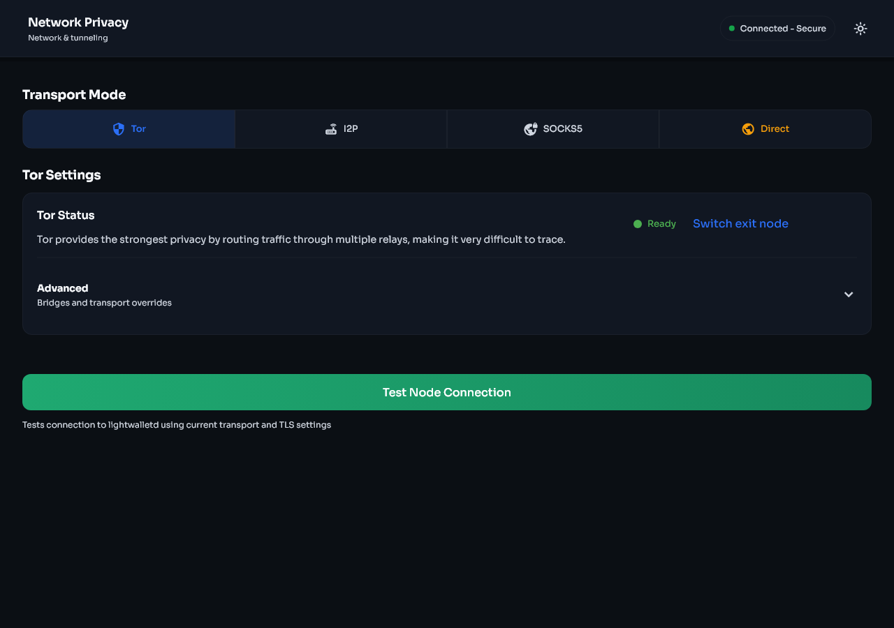
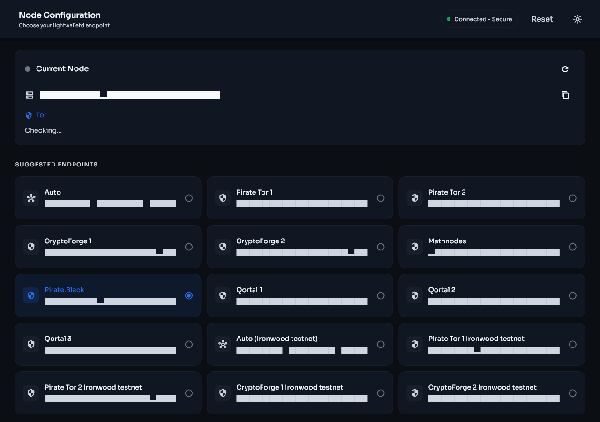

# Network privacy and synchronisation

[Previous: Moving from another wallet](migration.md) | [Guide contents](README.md) | [Next: Security and backups](security-and-backups.md)

Open **Settings > Privacy and Network > Transport** to select how Stashi Wallet reaches its light server.

| Mobile | Desktop |
|---|---|
|  |  |

## Transport choices

### Direct

Direct mode connects without an anonymity network. It is usually the simplest and fastest option, but the network path can reveal to your internet provider that the device is connecting to wallet infrastructure. Direct mode uses the device's configured DNS resolver.

### Tor

Tor routes the light-server connection through the Tor network. It improves network-level privacy but can be slower and may require time to establish a circuit. Stashi Wallet prefers the listed Tor endpoints and can also reach compatible clearnet endpoints through Tor when required.

Changing a Tor exit path does not change wallet keys or addresses.

### SOCKS5

SOCKS5 sends the connection through a proxy that you provide. Enter a host and port that you control or trust. A proxy can observe connection metadata and is not automatically private because it uses SOCKS5.

### I2P

I2P uses an available I2P route and a compatible endpoint. It requires working I2P connectivity on the device or through a supported configuration. An initial connection can take longer than Direct mode. I2P may not be available on every platform or release.

## Node selection

Open **Settings > Privacy and Network > Node**.

- **Auto** uses the endpoint pool and automatic failover checks.
- **Manual** remains connected to the selected server until you change it or return to Auto.

Auto mode checks more than whether a network connection opens. A usable endpoint must also report and serve suitable blockchain data. If a server is reachable but stalled or behind, Stashi Wallet can move to another endpoint.

Use Manual mode for testing or when you operate a trusted server. Return to Auto if the selected server stops advancing.

| Mobile | Desktop |
|---|---|
|  |  |

## Synchronisation stages

- **Preparing sync** means that Stashi Wallet is opening the wallet database, checking its state, selecting an endpoint, and preparing cached or remote block data.
- **Downloading** means that Stashi Wallet is obtaining compact blockchain data that is not already cached.
- **Scanning** means that Stashi Wallet is testing compact outputs against the wallet's Sapling and Ironwood keys and updating wallet information.
- **Finalising** means that Stashi Wallet is saving the latest results and refreshing balances and Activity.
- **Synced** means that Stashi Wallet has processed the chain height reported by the light server.

The blockchain height should continue to move when the chain advances. A connected status without block progress does not confirm that a server is healthy.

## Cached blocks and rescans

Stashi Wallet keeps validated compact blocks locally so that a rescan does not need to download the same range again. Stashi Wallet checks cached data before reuse. Adding a seed account or imported key starts the historical replay required to test the new key against the relevant blocks.

## If Preparing sync does not finish

1. Leave Stashi Wallet open for several minutes after an update, local data upgrade, key import, or seed-account addition.
2. Confirm that the device has working internet access.
3. In Auto node mode, allow time for endpoint health checks and failover.
4. Try another transport. Direct mode can help determine whether Tor, I2P, or a proxy is preventing the connection.
5. Select another light server manually, then return to Auto after testing.
6. Restart the application.
7. Check the available storage and system time.
8. Enable debug logging and reproduce the delay.

Do not start another rescan while a scan is active.

## Rescan the wallet

Use a rescan when Stashi Wallet has the correct keys but its local transaction information is incomplete.

1. Open **Settings > Advanced > Rescan blockchain**.
2. Select a height before the earliest missing transaction.
3. Confirm the rescan.
4. Keep the application open and allow the rescan to finish.
5. Check Activity and the confirmed balance.

An earlier start height requires more time but does not exclude a later transaction. A rescan cannot find funds that belong to a different seed phrase, a missing seed account, or a private key that was not imported.
