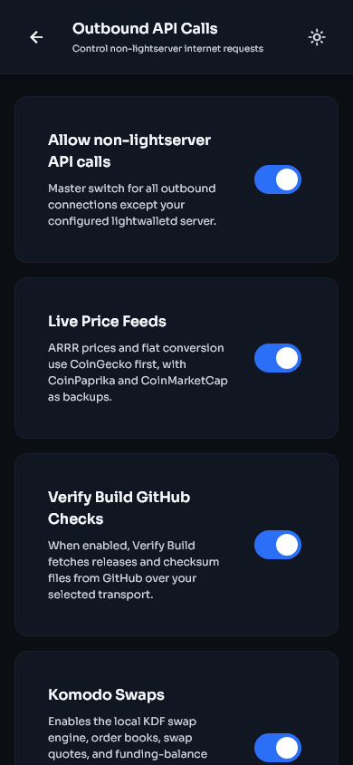
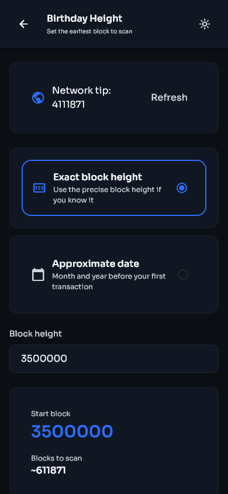
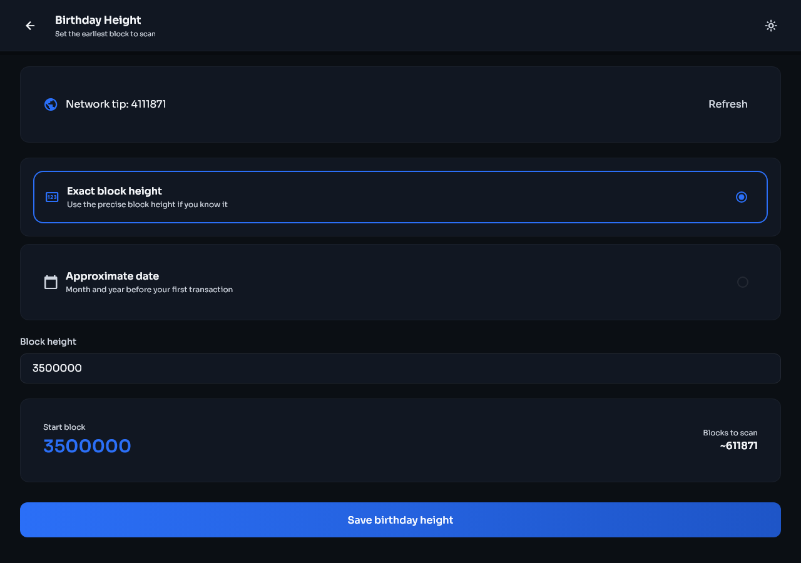
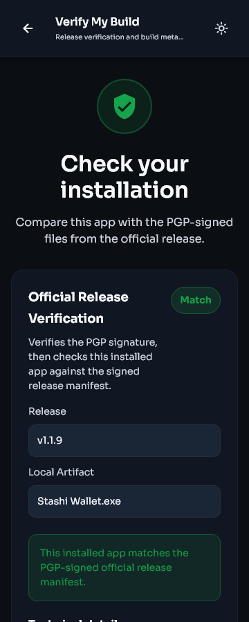
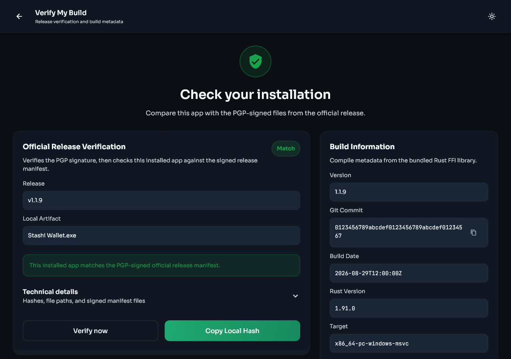
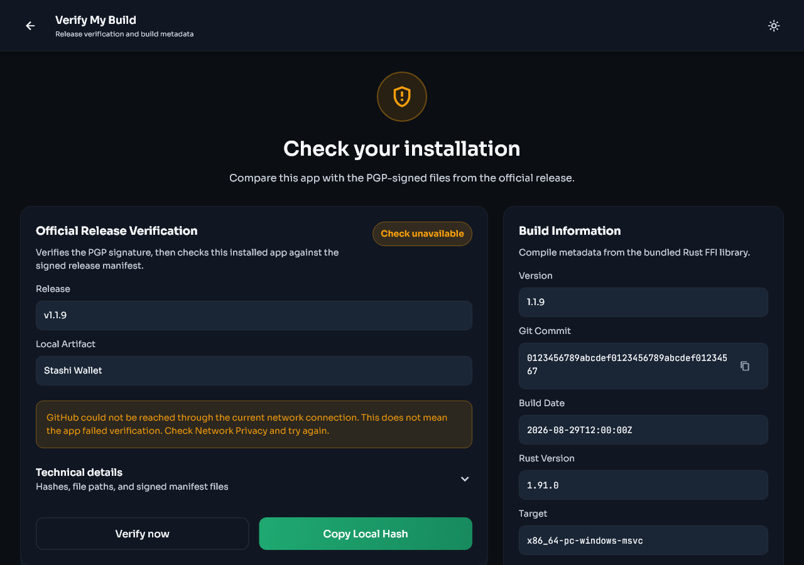

# Settings and release verification

[Previous: Security and backups](security-and-backups.md) | [Guide contents](README.md) | [Next: Troubleshooting](troubleshooting.md)

## Settings map

| Section | What it controls |
|---|---|
| Security | Biometrics, local passphrase, and duress passphrase |
| Privacy and Network | Light-server node, Direct, Tor, SOCKS5, I2P, and non-lightserver API access |
| Backups | Seed phrase display and confirmation |
| Wallet | Keys, seed accounts, addresses, and auto consolidation |
| Trading | Swap interface preference when swaps are enabled |
| Appearance | Theme, fiat currency, application language, and seed phrase language |
| Advanced | Birthday height, blockchain rescan, debug logging, and diagnostics |
| About | Version, Verify build, terms, privacy information, and open source licences |

| Mobile | Desktop |
|---|---|
|  |  |

## Outbound API Calls

The light-server connection is required for wallet synchronisation. Other internet features can be controlled separately under **Settings > Privacy and Network > Outbound API Calls**.

- **Live Price Feeds** controls ARRR price and fiat conversion requests. Stashi Wallet uses CoinGecko first, with CoinPaprika and CoinMarketCap as alternatives.
- **Verify Build GitHub Checks** allows Stashi Wallet to download signed release metadata from GitHub.
- **Komodo Swaps** allows order book, quote, and funding balance requests when swaps are supported.
- **Desktop Update Checks** allows desktop versions to check GitHub for new releases.

Turning off **Allow non-lightserver API calls** disables all of these non-lightserver requests. Turning off **Live Price Feeds** can leave the fiat estimate blank without affecting ARRR funds.

| Mobile | Desktop |
|---|---|
|  |  |

## Currency, language, and theme

- The currency setting changes only the estimated fiat display. It does not convert or move ARRR.
- The application language setting changes menus and messages.
- The seed phrase language setting tells Stashi Wallet how to interpret seed words. Do not change it casually for an existing backup.
- The theme setting changes only the appearance.

## Birthday height

The birthday height is the earliest block that Stashi Wallet needs to inspect. Set it before the first expected transaction.

1. Open **Settings > Advanced > Birthday height**.
2. Select an approximate date or enter an exact height.
3. Save the value.
4. Start the offered rescan if you are trying to recover earlier history.

| Mobile | Desktop |
|---|---|
|  |  |

Moving the birthday height earlier increases scanning work. Moving it later can exclude previous transactions from a future rescan.

## Verify the Stashi Wallet installation

Open **Settings > About > Verify build**, then select **Verify now**. Stashi Wallet downloads the signed release manifest for its exact version, verifies the PGP signature against the pinned Stashi Wallet release key, hashes the installed application file, and compares the result with the signed checksum.

| Mobile | Desktop |
|---|---|
|  |  |

### Result meanings

- **Match** means that the PGP-signed official manifest was valid and the local file hash matched its entry.
- **Check unavailable** means that Stashi Wallet could not complete the online check. This is not a failed integrity result. Check the selected transport and outbound GitHub permission, then try again.
- **Mismatch** means that the local file did not match the signed manifest. Stop using that installation for sensitive work and download a fresh copy from the official release page.
- **Unsupported package** means that the current platform or package format does not expose a local file that the verifier can hash. Use manual release verification.

An unavailable network check is shown differently from a cryptographic mismatch.



The screenshots use sample release data to show the possible states. The version, filename, hash, target, and release date will differ on your device.

## Verify the downloaded release files

Each official release provides a signature bundle for its tag. The bundle contains the Stashi Wallet public key, a checksum manifest, a signature for that manifest, and detached signatures for release files.

The authoritative primary key fingerprint is:

```text
E4FB 2399 AECC F9B9 447D ED47 2CE6 5343 4015 53A6
```

The existing user ID on that key is:

```text
Pirate Unified Wallet <dev@piratechainfoundation.com>
```

The previous user ID text remains attached to the same established Stashi Wallet release key. Confirm the complete fingerprint through an independent official Pirate Network channel. Do not trust a key only because it was downloaded beside the file that it signs.

Typical GnuPG steps are:

```bash
gpg --import public_key.asc
gpg --fingerprint E4FB2399AECCF9B9447DED472CE65343401553A6
gpg --verify sha256sum-vX.Y.Z.txt.sig sha256sum-vX.Y.Z.txt
gpg --verify Stashi-Wallet-linux-x86_64.AppImage.sig Stashi-Wallet-linux-x86_64.AppImage
```

Use the filenames from the release that you downloaded. PGP verification does not decrypt the application. It proves that the matching private key signed those exact files.

For the full command reference, see [Verify Builds](../verify-build.md).

## Debug logging

Debug logging is off by default.

1. Open **Settings > Advanced > Debug logging**.
2. Read the warning and enable debug logging.
3. Reproduce the problem.
4. Return to Debug logging and use the share or save action.
5. Turn off debug logging when you have finished. Disabling it clears the active debug log when the screen states that it will do so.

The active `debug.log` file is stored at the following location:

- Windows: `%LOCALAPPDATA%\Pirate\PirateWallet\data\logs\debug.log`
- macOS: `~/Library/Application Support/com.Pirate.PirateWallet/logs/debug.log`
- Linux: `${XDG_DATA_HOME:-~/.local/share}/piratewallet/logs/debug.log`
