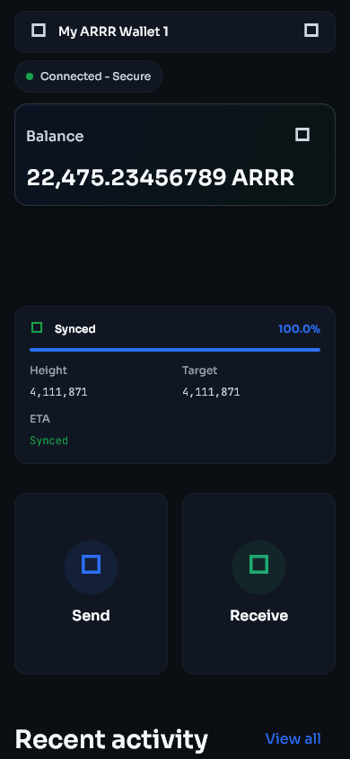
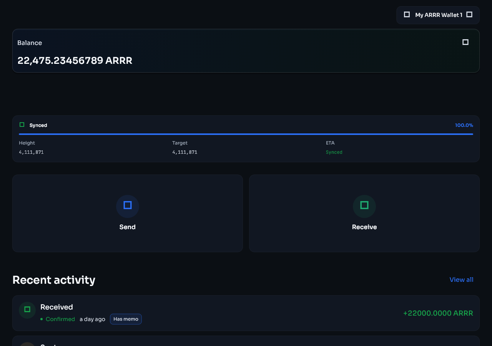
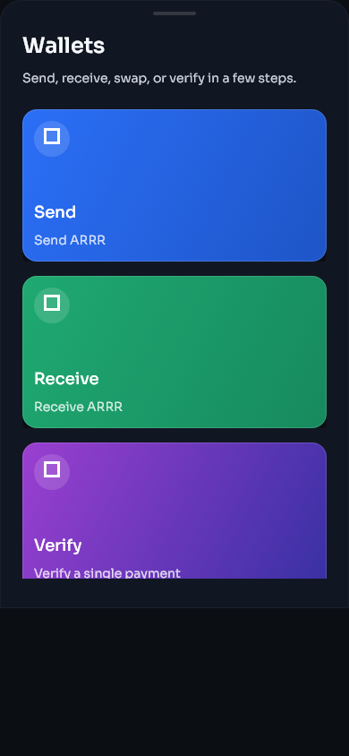
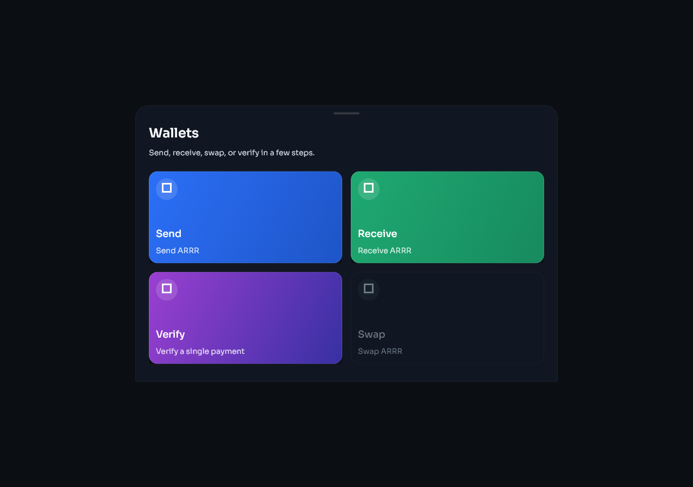
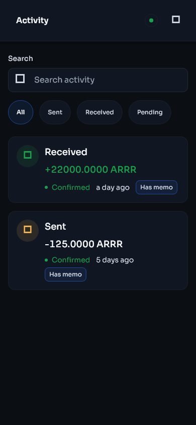
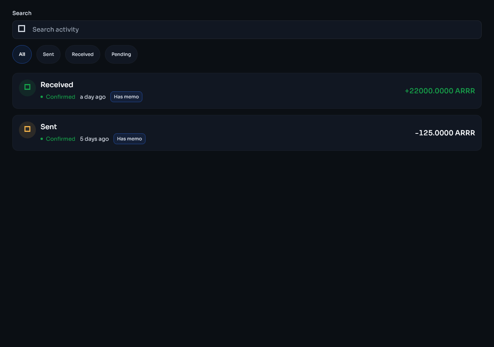
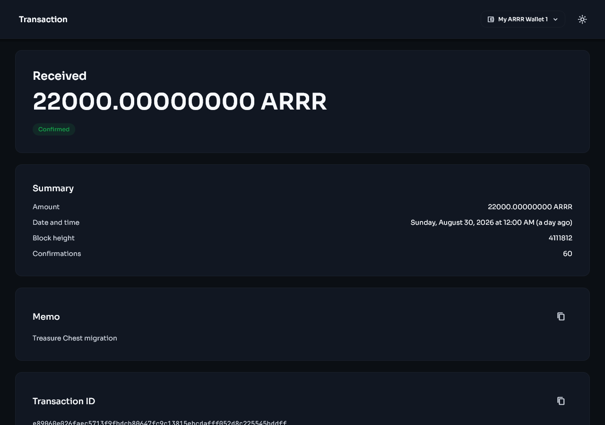
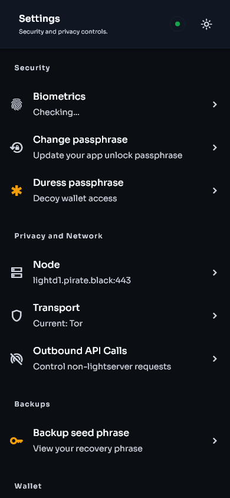
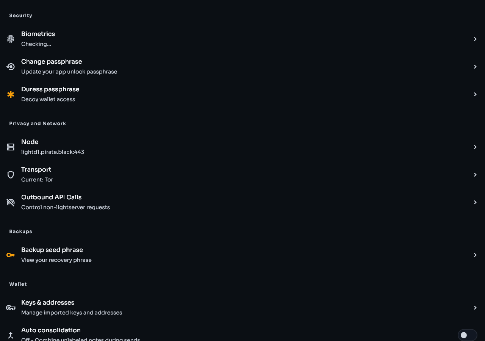

# Wallet basics

[Previous: Getting started](getting-started.md) | [Guide contents](README.md) | [Next: Send and receive](send-receive.md)

## Home

The Home page shows the selected wallet, connection status, balance, fiat estimate, synchronisation progress, and shortcuts for common tasks.

| Mobile | Desktop |
|---|---|
|  |  |

### Wallet selector

Use the wallet name at the top of the page to switch between wallets. Check the selected wallet before copying an address, importing a key, or sending funds.

### Connection status

The connection status indicator reports whether Stashi Wallet is connected. When it shows **Connected - Secure**, select it to view the active privacy transport, such as Direct, Tor, SOCKS5, or I2P when available. A connection does not confirm that blockchain processing has finished. Check the synchronisation information as well.

### Balance information

- The main balance shows the wallet's ARRR amount.
- Use the hide or show icon, represented by an eye, to hide or show the values.
- The estimated fiat value appears in smaller text and uses the currency selected under Settings.
- Use the switch icon, represented by two arrows, to exchange the positions of the ARRR and fiat values.
- Fiat prices come from an external price service and can be temporarily unavailable. This does not affect the ARRR balance.

### Synchronisation information

The synchronisation area shows the current stage, blockchain height, progress, and estimated completion time when available. Common stages include **Preparing sync**, downloading, scanning, and **Synced**. Keep the application open if the operating system restricts background activity.

## Wallets

The Wallets page provides access to send, receive, swap, and payment verification tools.

| Mobile | Desktop |
|---|---|
|  |  |

Scroll on a small screen to view every available action. Depending on the selected wallet and available features, the page can include send, receive, sweep, swap, and payment disclosure tools.

## Activity

Activity lists the wallet transactions that Stashi Wallet has detected. Open a transaction to view its direction, status, amount, fee, memo, available addresses, block information, and transaction ID.

| Mobile | Desktop |
|---|---|
|  |  |

| Transaction details on mobile | Transaction details on desktop |
|---|---|
|  |  |

New transactions can appear before final confirmation. Do not treat an unconfirmed incoming payment as final. If an expected transaction is absent, wait for full synchronisation and follow [Missing balance or transaction](troubleshooting.md#missing-balance-or-transaction).

## Settings

Settings contains security, network, backup, key, appearance, synchronisation, diagnostics, and release verification controls.

| Mobile | Desktop |
|---|---|
|  |  |

## Navigation on different screen sizes

- On a mobile device, use the navigation bar at the bottom and scroll long pages vertically.
- On a desktop computer or tablet, navigation may use more horizontal space, and related information may appear in columns.
- With a keyboard, use Tab and Shift+Tab to move between controls. Use Enter or Space to activate a control, and use Escape to close a dialogue where supported.
